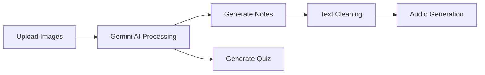

# 🧠✨ NoteGen AI  
### Turn Images into Smart Notes, Audio & Quizzes

  

  
  
  
  

---

## 📌 Overview

**NoteGen AI** is an AI-powered web app that converts images into:

- 📝 Structured Notes (Bangla + English)
- 🔊 Audio Summaries
- 🧠 Auto-generated Quizzes with Answers

Perfect for students and learners who want quick understanding from images.

---

## 🎯 Features

- 📂 Upload up to **3 images**
- 📝 Generate **clean notes (English + Bangla)**
- 🔊 Convert notes into **audio**
- 🧠 Generate **quiz (Easy / Medium / Hard)**
- ⚡ Fast and simple UI

---

## 🖥️ Live Demo

👉 https://note-genai.streamlit.app/

---

## 🧩 How It Works

